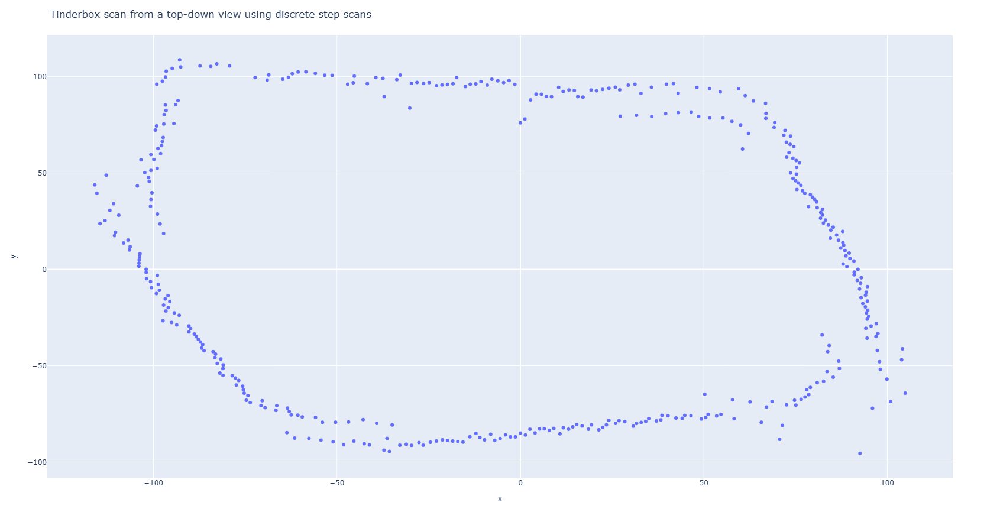

## 3D object reconstruction

Attempt at 3D object reconstruction with an object on top of a spinning platform powered by a step motor and a VL53L1X Time-of-Flight distance sensor. The idea was to place the distance sensor on a linear actuator to create the 3D model layer-by-layer.

Problems with this approach:
- Could not perfectly center the object, which is essential for the reconstruction algorithm. Vibrations did not help.
- Used sensor showed static distance measurement inconsistency up to 5mm which is very destructive when scanning small objects.

This repo also contains some C++ driver classes for a step motor, VL53L1X distance sensor and a PWM motor driver.
